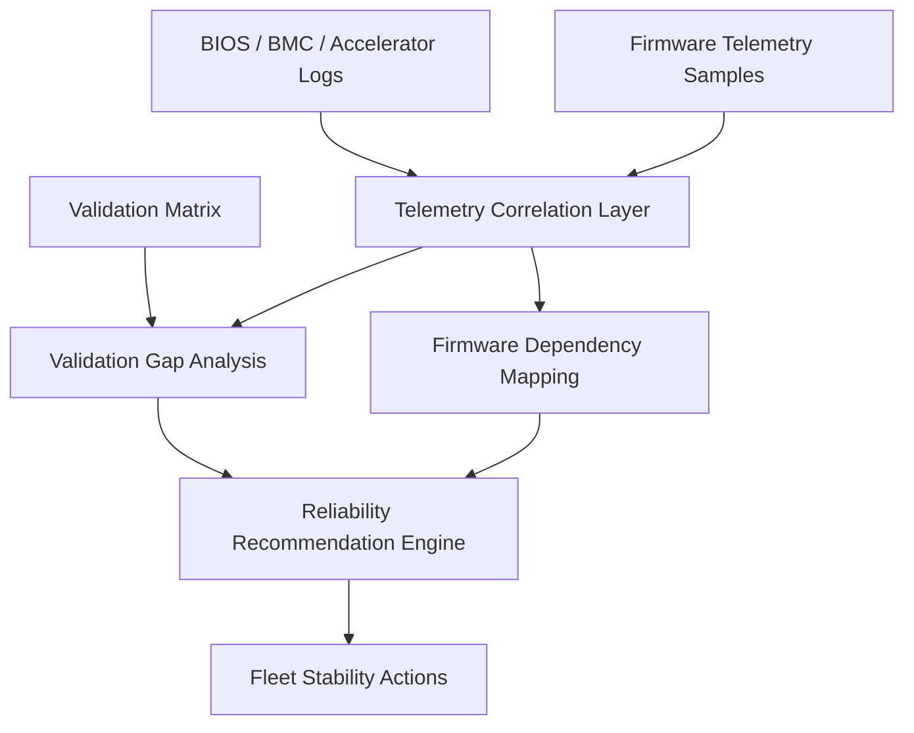
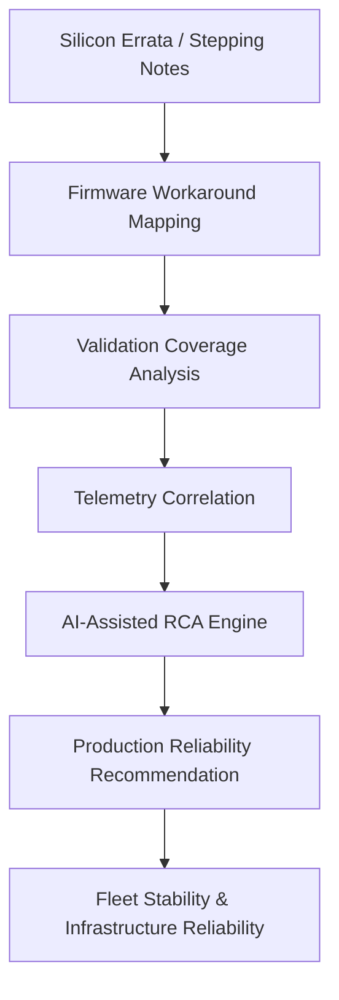
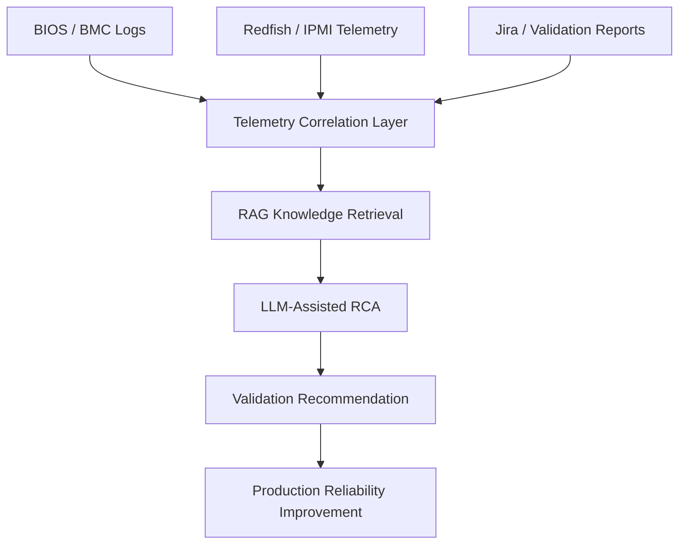

# AI Accelerator Reliability Intelligence

FastAPI MVP for AI infrastructure reliability analysis. The prototype ingests fictional accelerator firmware logs and telemetry, correlates incidents, detects validation coverage gaps, maps firmware dependencies, and produces reliability recommendations.

This is intentionally not a chatbot demo. It is structured like a small reliability intelligence service that could later connect to fleet telemetry, release validation systems, firmware manifests, incident workflows, RAG knowledge retrieval, and AI-assisted RCA.

## Overview

Modern AI infrastructure systems are increasingly complex across firmware, accelerators, power systems, telemetry, networking, validation workflows, and distributed operations.

This project explores an AI-native infrastructure reliability framework for GPU/TPU-class environments. The goal is to transform fragmented engineering knowledge into actionable operational intelligence.

## Core Concepts

- Silicon errata intelligence
- Firmware workaround and dependency mapping
- Validation coverage analysis
- Telemetry correlation
- AI-assisted root cause analysis
- Infrastructure dependency graph analysis
- Predictive reliability workflows
- Fleet reliability recommendations

## MVP Scope

- Log parser for accelerator firmware and platform log lines
- Telemetry correlator for matching incidents to sampled health metrics
- Validation gap analyzer for release-test coverage misses
- Firmware dependency mapper for blast-radius analysis
- Recommendation engine for prioritized reliability actions
- Fictional but realistic sample data and generated example outputs

## Project Structure

```text
app/
  api/
    routes.py
  data/
    accelerator_logs.log
    firmware_dependencies.json
    telemetry_samples.json
    validation_matrix.json
  models/
    schemas.py
  services/
    data_repository.py
    firmware_dependency_mapper.py
    log_parser.py
    recommendation_engine.py
    telemetry_correlator.py
    validation_gap_analyzer.py
  main.py
docs/
  PROJECT_PLAN.md
  firmware_dependency_mapping.md
  telemetry_correlation.md.md
  validation_gap_analysis.md
examples/
  api_responses/
  sample_outputs/
scripts/
  generate_examples.py
requirements.txt
```

## Setup

```bash
python -m venv .venv
.venv\Scripts\activate
pip install -r requirements.txt
uvicorn app.main:app --reload
```

Open:

- API docs: `http://127.0.0.1:8000/docs`
- Health check: `http://127.0.0.1:8000/health`

## API Endpoints

- `GET /api/v1/logs/parsed`
- `GET /api/v1/telemetry/correlated`
- `GET /api/v1/validation/gaps`
- `GET /api/v1/firmware/dependencies`
- `GET /api/v1/recommendations`

## Architecture

The application is split into thin API routes, shared Pydantic domain models, local sample-data access, and focused reliability services.

`LogParser` converts structured firmware log lines into `AcceleratorLogEntry` records. It preserves subsystem, event code, firmware version, rack, and extra key-value metadata so later stages can reason about operational context.

`TelemetryCorrelator` links warning, error, and critical log events to nearest telemetry samples for the same accelerator and firmware version. It flags anomalous signals such as uncorrectable HBM ECC, PCIe replay storms, fabric CRC bursts, thermal boundary crossing, power overshoot, and latency impact.

`ValidationGapAnalyzer` compares correlated failure modes against the sample validation matrix. It identifies missing coverage for firmware versions, workload phases, and newly observed failure modes.

`FirmwareDependencyMapper` turns a firmware integration manifest into dependency adjacency and blast-radius views. This helps explain which runtime, driver, hardware, and fleet surfaces may be affected by a subsystem issue.

`RecommendationEngine` combines correlated incidents, validation gaps, and dependency blast radius into prioritized reliability recommendations with rationale, evidence, affected components, expected impact, and next steps.

## Reliability Workflow



## Regenerate Example Outputs

```bash
python scripts/generate_examples.py
```

Generated outputs are stored in:

- `examples/sample_outputs/parsed_logs.json`
- `examples/sample_outputs/correlated_telemetry_events.json`
- `examples/sample_outputs/validation_gaps.json`
- `examples/sample_outputs/firmware_dependency_map.json`
- `examples/sample_outputs/reliability_recommendations.json`

Mirrored API response examples are stored in `examples/api_responses`.

The API response examples include:

- `GET_api_v1_logs_parsed.json`
- `GET_api_v1_telemetry_correlated.json`
- `GET_api_v1_validation_gaps.json`
- `GET_api_v1_firmware_dependencies.json`
- `GET_api_v1_recommendations.json`

## Example Output Highlights

The sample data produces:

- Correlated HBM ECC escalation on `accel-a17` during `kv-cache-spill`
- PCIe replay storm on `accel-b03` during `host-dma-burst`
- Fabric CRC burst on release-candidate firmware `7.5.0-rc2`
- Thermal throttle boundary oscillation under sustained inference
- Power transient overshoot during an LLM prefill batch-size step

Validation gap examples include missing coverage for:

- HBM ECC escalation on firmware `7.4.2` during `kv-cache-spill`
- Fabric CRC burst on firmware `7.5.0-rc2` during distributed allreduce
- Thermal throttle boundary behavior during sustained inference

## Extensibility Notes

---

# Why This Matters

As hyperscale AI infrastructure continues scaling, reliability challenges are becoming increasingly difficult to manage across:

- firmware
- drivers
- operating systems
- accelerators
- thermal systems
- power sequencing
- distributed workloads
- validation environments

Traditional engineering workflows were not designed for this level of infrastructure complexity.

This project explores how telemetry, RAG pipelines, infrastructure knowledge graphs, and LLM-assisted reasoning can improve operational reliability at scale.

---

# Proposed Architecture



---

# AI-Native Infrastructure Diagnostics Workflow



---

# Example Reliability Recommendation

```json
{
  "risk_level": "High",
  "possible_root_cause": "Firmware workaround missing for accelerator warm reset condition",
  "recommended_validation": "Add warm reset loop test under high temperature with accelerator workload active",
  "recommended_owner": "Firmware / Validation"
}
```

- Replace `DataRepository` with adapters for log stores, telemetry streams, release validation systems, or firmware manifest registries.
- Add richer time-window correlation in `TelemetryCorrelator` when real event timestamps and sample cadence are available.
- Expand `ValidationGapAnalyzer` with stale-test detection, environment matching, and release-blocking policy.
- Connect `RecommendationEngine` to ticketing, incident tooling, or RAG-backed RCA workflows once recommendation confidence and ownership rules mature.
