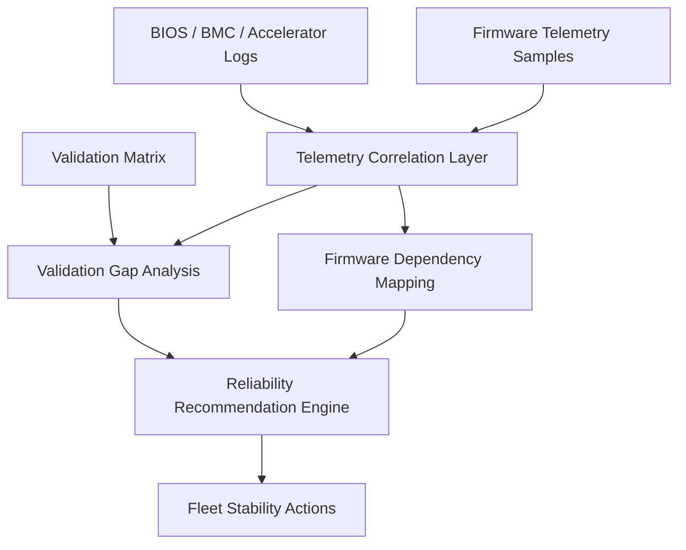
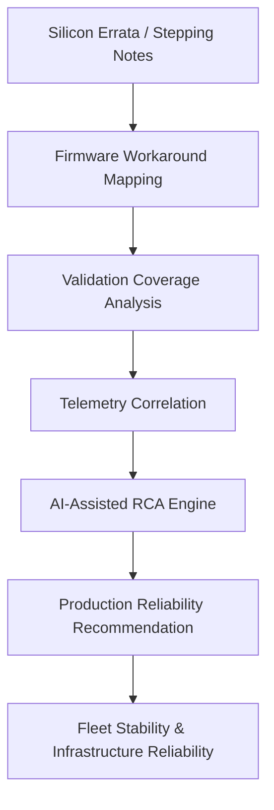
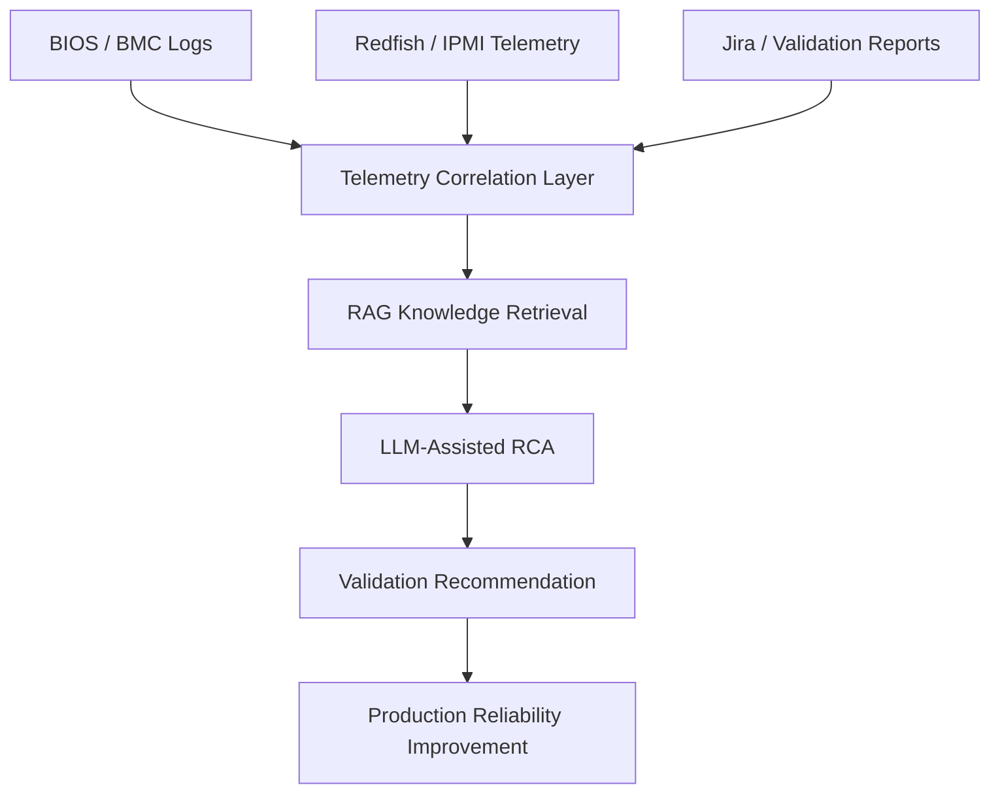

# AI Accelerator Reliability Intelligence (AI-RI)

A FastAPI-based Microservice Infrastructure for Cross-Layer Telemetry Log Fusion, Real-Time Root Cause Analysis (RCA), and Automated Triage inside Hyperscale AI Factories.

This project is intentionally architected as a production-ready reliability intelligence service rather than a generic chatbot demo. It acts as the critical software-hardware bridge that ingests distributed telemetry, correlates core platform signals, and leverages domain-specific AI logic to automate triage and secure 99.999% uptime for high-density compute clusters.

---

## 🌟 Strategic Focus: Transforming Volume into Intelligence

As hyperscale AI infrastructure continues scaling across distributed topologies, reliability challenges have transcended traditional diagnostic capabilities. A single hardware or fabric fault can induce cascading synchronization timeouts (such as distributed All-Reduce Timeouts), halting massive LLM training clusters and resulting in catastrophic financial and SLA leakage.

When a high-density node crashes, operations teams are traditionally faced with an isolated "chaos of logs":
* **Host BIOS:** Hexadecimal Machine Check Exceptions (MCE Status registers)
* **Server BMC:** Fragmented System Event Logs (IPMI SEL)
* **Accelerator Subsystems:** Satellite BMC (SBMC) errata and fabric symbol errors (PLDM/MCTP sideband telemetry)

**AI-RI** serves as the definitive architecture to fuse these heterogeneous, multi-layer signals into a synchronized microsecond timeline at the exact millisecond of failure. By binding **24 years of enterprise server heritage**—forged across million-shipment portfolios like the ProLiant MicroServer, ML150/310/350, DL120/320 series, and the ultra-dense HPE Moonshot 1500 system—this framework maps raw hardware symptoms to precise silicon errata root causes and delivers actionable operational solutions instantly.

### 🧠 Deep Diagnostic Logic: Beyond the Black Box

The core inference engine of **AI-RI** is not a generic "black box" chatbot. It follows a rigorous, three-layer hardware-software co-engineering logic:

1.  **Deterministic Signature Identification:** 
    Instead of guessing, the system first traps low-level hardware telemetry via **PLDM/MCTP**. It parses raw binary registers such as **BIOS MCE (Machine Check Exceptions)** and **PCIe AER (Advanced Error Reporting)** to extract deterministic "physics-level" failure signatures (e.g., Vdroop transients, PCIe link training timeouts).

2.  **Temporal & Fleet Correlation:** 
    Using a sliding-window temporal alignment algorithm, the system fuses asynchronous logs across the entire cluster. It performs **Fleet Baseline Peer Comparison** to differentiate between individual hardware degradation and cluster-wide regression (e.g., identifying firmware-induced power profile defects across a specific cohort of nodes).

3.  **Semantic Reasoning via Silicon Errata RAG:** 
    The engine utilizes **Retrieval-Augmented Generation (RAG)** to index thousands of pages from Intel/NVIDIA **Silicon Errata manuals** and 24 years of proprietary RCA wiki data. It maps current failure vectors against documented silicon errata to deliver sub-second, actionable triage solutions that prevent cascading "All-Reduce" timeouts in LLM training.
---

## 🏗 Core Concepts & Capabilities

* **Silicon Errata Intelligence:** Cross-referencing CPU/GPU stepping anomalies and active hardware workarounds.
* **Cross-Layer Log Fusion:** Binding asynchronous telemetry across BIOS, BMC, and accelerator sideband.
* **Deterministic Pattern Mapping:** Converting complex hardware failure modes into clean, identifiable signature vectors.
* **Validation Gap Analysis:** Correlating real-world field crashes back to automated release-test matrices to eliminate coverage misses.
* **Automated Mitigations:** Driving Infrastructure-as-Code (IaC) routines to enforce dynamic power capping, thermal adjustment, or graceful node evacuation prior to cluster-wide failure.

---

## 📂 Project Structure

```text
app/
  api/
    routes.py                     # Thin RESTful API routes handling Redfish and telemetry ingestion
  data/
    accelerator_logs.log          # Raw multi-layer firmware and OS log lines
    firmware_dependencies.json    # Manifest mapping subsystem blast radius and adjacency
    gpu_telemetry_logs.jsonl      # High-cadence GPU fleet telemetry stream samples
    telemetry_samples.json        # Normalized JSON target matrices
    validation_matrix.json        # Release validation test coverage matrix
  models/
    schemas.py                    # Strong Pydantic domain models for rigorous validation
  services/
    anomaly_detector.py           # Real-time monitoring for HBM ECC, PCIe replays, and fabric CRC
    analyzer.py                   # Local intelligence and pattern arbitration orchestration
    data_repository.py            # Extensible local data access adapters
    firmware_dependency_mapper.py # Blast-radius calculation across runtime and firmware layers
    infrastructure_advisor.py     # High-level operations advisor (Rollout freezes, quarantines)
    log_parser.py                 # Structural converter translating hardware lines to domain objects
    recommendation_engine.py      # Core engine outputting Root Cause and Actionable Solutions
    risk_scoring.py               # Aggregated 0-100 risk matrices for rack and node-level triage
    telemetry_correlator.py       # Microsecond-window time-series alignment handler
    telemetry_ingestion.py        # Normalizes broad field aliases into canonical schemas
    validation_gap_analyzer.py    # Tracks missing test cases for workload phases and platforms
  main.py                         # FastAPI Application entrypoint
docs/
  PROJECT_PLAN.md
  firmware_dependency_mapping.md
  telemetry_correlation.md
  validation_gap_analysis.md
examples/
  api_responses/
  sample_outputs/
scripts/
  generate_examples.py            # Utility script simulating real-world infrastructure failures
requirements.txt

```bash
python -m venv .venv
.venv\Scripts\activate
pip install -r requirements.txt
uvicorn app.main:app --reload
```

Start the service from the project root:

```bash
cd ai-accelerator-reliability-intelligence
.venv\Scripts\activate
uvicorn app.main:app --reload --host 127.0.0.1 --port 8000
```

Recommended `uvicorn` flags for local development:

```bash
uvicorn app.main:app \
  --reload \
  --host 127.0.0.1 \
  --port 8000 \
  --log-level debug \
  --reload-dir app \
  --reload-dir scripts
```

Development environment notes:

- Use the included `.venv` for dependency isolation.
- Install dependencies with `pip install -r requirements.txt`.
- Keep `app/main.py`, `app/api/routes.py`, and `app/models/schemas.py` synchronized when extending models or endpoints.
- Run the smoke test after changes:

```bash
python scripts/run_analysis_smoke_test.py
```

## Docker Development Mode

If you want to run the service in a containerized local environment, use a lightweight Python image and mount the project directory:

```bash
docker run --rm -it \
  -v "%cd%/ai-accelerator-reliability-intelligence:/app" \
  -w /app \
  python:3.14-slim \
  bash -lc "pip install -r requirements.txt && uvicorn app.main:app --reload --host 0.0.0.0 --port 8000"
```

Then open the service on your host at:

- `http://127.0.0.1:8000/docs`
- `http://127.0.0.1:8000/health`

## Common Troubleshooting

- If FastAPI fails to start because `uvicorn` is missing, reinstall dependencies:

```bash
pip install -r requirements.txt
```

- If the import path fails under the subproject, ensure the working directory is `ai-accelerator-reliability-intelligence` and the Python path includes the local `app` package.

- If `pydantic` validation raises `Telemetry payload failed schema validation`, verify the telemetry payload fields match `app/models/schemas.py`.

- If `scripts/run_analysis_smoke_test.py` fails, check that `app/services/analyzer.py` and `app/services/telemetry_ingestion.py` are present and that `DataRepository` loads the local sample JSON files.

Open:

- API docs: `http://127.0.0.1:8000/docs`
- Health check: `http://127.0.0.1:8000/health`
- Root analyze alias: `http://127.0.0.1:8000/analyze`
- Router analyze endpoint: `http://127.0.0.1:8000/api/v1/analyze`

## API Endpoints

- `GET /api/v1/logs/parsed`
- `GET /api/v1/telemetry/correlated`
- `GET /api/v1/validation/gaps`
- `GET /api/v1/firmware/dependencies`
- `GET /api/v1/recommendations`
- `POST /api/v1/analyze`
- `POST /analyze`

## Example API Requests

Analyze with sample telemetry payload:

```bash
curl -X POST "http://127.0.0.1:8000/api/v1/analyze" \
  -H "Content-Type: application/json" \
  -d '{
    "telemetry": [
      {
        "timestamp": "2026-05-28T10:00:00Z",
        "accelerator_id": "accel-a17",
        "rack_id": "rack-01",
        "firmware_version": "7.5.0-rc2",
        "workload_id": "job-123",
        "workload_phase": "kv-cache-spill",
        "temperature_c": 89.2,
        "hbm_ecc_corrected": 0,
        "hbm_ecc_uncorrected": 1,
        "pcie_replay_count": 1200,
        "power_watts": 655.0,
        "fabric_crc_errors": 3,
        "inference_latency_ms": 47.4
      }
    ]
  }'
```

Analyze from the bundled telemetry sample data:

```bash
curl -X POST "http://127.0.0.1:8000/api/v1/analyze" \
  -H "Content-Type: application/json" \
  -d '{}'
```

Python local analyzer usage:

```python
from pathlib import Path
import sys
sys.path.insert(0, str(Path(__file__).resolve().parents[1]))

from app.services.analyzer import ReliabilityAnalyzer
from app.services.data_repository import DataRepository

repository = DataRepository()
payload = repository.load_telemetry()
response = ReliabilityAnalyzer().analyze(payload)
print(response.model_dump(mode="json"))
```

## Smoke Test

A lightweight test script exercises the analyzer pipeline and writes a JSON response.

```bash
cd ai-accelerator-reliability-intelligence
python scripts/run_analysis_smoke_test.py
```

The script writes its output to `scripts/output/analysis_response.json`.

## Architecture

The application is split into thin API routes, shared Pydantic domain models, local sample-data access, and focused reliability services.

`LogParser` converts structured firmware log lines into `AcceleratorLogEntry` records. It preserves subsystem, event code, firmware version, rack, and extra key-value metadata so later stages can reason about operational context.

`TelemetryCorrelator` links warning, error, and critical log events to nearest telemetry samples for the same accelerator and firmware version. It flags anomalous signals such as uncorrectable HBM ECC, PCIe replay storms, fabric CRC bursts, thermal boundary crossing, power overshoot, and latency impact.

`ValidationGapAnalyzer` compares correlated failure modes against the sample validation matrix. It identifies missing coverage for firmware versions, workload phases, and newly observed failure modes.

`FirmwareDependencyMapper` turns a firmware integration manifest into dependency adjacency and blast-radius views. This helps explain which runtime, driver, hardware, and fleet surfaces may be affected by a subsystem issue.

`RecommendationEngine` combines correlated incidents, validation gaps, and dependency blast radius into prioritized reliability recommendations with rationale, evidence, affected components, expected impact, and next steps.

## Reliability Workflow



## Regenerate Example Outputs

```bash
python scripts/generate_examples.py
```

Generated outputs are stored in:

- `examples/sample_outputs/parsed_logs.json`
- `examples/sample_outputs/correlated_telemetry_events.json`
- `examples/sample_outputs/validation_gaps.json`
- `examples/sample_outputs/firmware_dependency_map.json`
- `examples/sample_outputs/reliability_recommendations.json`

Mirrored API response examples are stored in `examples/api_responses`.

The API response examples include:

- `GET_api_v1_logs_parsed.json`
- `GET_api_v1_telemetry_correlated.json`
- `GET_api_v1_validation_gaps.json`
- `GET_api_v1_firmware_dependencies.json`
- `GET_api_v1_recommendations.json`

## Example Output Highlights

The sample data produces:

- Correlated HBM ECC escalation on `accel-a17` during `kv-cache-spill`
- PCIe replay storm on `accel-b03` during `host-dma-burst`
- Fabric CRC burst on release-candidate firmware `7.5.0-rc2`
- Thermal throttle boundary oscillation under sustained inference
- Power transient overshoot during an LLM prefill batch-size step

Validation gap examples include missing coverage for:

- HBM ECC escalation on firmware `7.4.2` during `kv-cache-spill`
- Fabric CRC burst on firmware `7.5.0-rc2` during distributed allreduce
- Thermal throttle boundary behavior during sustained inference

## Extensibility Notes

---

# Why This Matters

As hyperscale AI infrastructure continues scaling, reliability challenges are becoming increasingly difficult to manage across:

- firmware
- drivers
- operating systems
- accelerators
- thermal systems
- power sequencing
- distributed workloads
- validation environments

Traditional engineering workflows were not designed for this level of infrastructure complexity.

This project explores how telemetry, RAG pipelines, infrastructure knowledge graphs, and LLM-assisted reasoning can improve operational reliability at scale.

---

# Proposed Architecture



---

# AI-Native Infrastructure Diagnostics Workflow



---

# Example Reliability Recommendation

```json
{
  "risk_level": "High",
  "possible_root_cause": "Firmware workaround missing for accelerator warm reset condition",
  "recommended_validation": "Add warm reset loop test under high temperature with accelerator workload active",
  "recommended_owner": "Firmware / Validation"
}
```

- Replace `DataRepository` with adapters for log stores, telemetry streams, release validation systems, or firmware manifest registries.
- Add richer time-window correlation in `TelemetryCorrelator` when real event timestamps and sample cadence are available.
- Expand `ValidationGapAnalyzer` with stale-test detection, environment matching, and release-blocking policy.
- Connect `RecommendationEngine` to ticketing, incident tooling, or RAG-backed RCA workflows once recommendation confidence and ownership rules mature.
>>>>>>> 7690e5e (Complete subproject reliability analyzer scaffold, README improvements, and smoke test)
