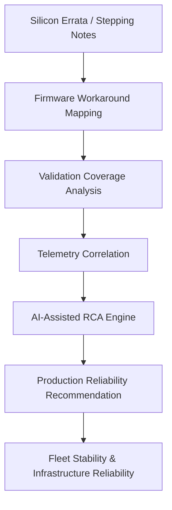
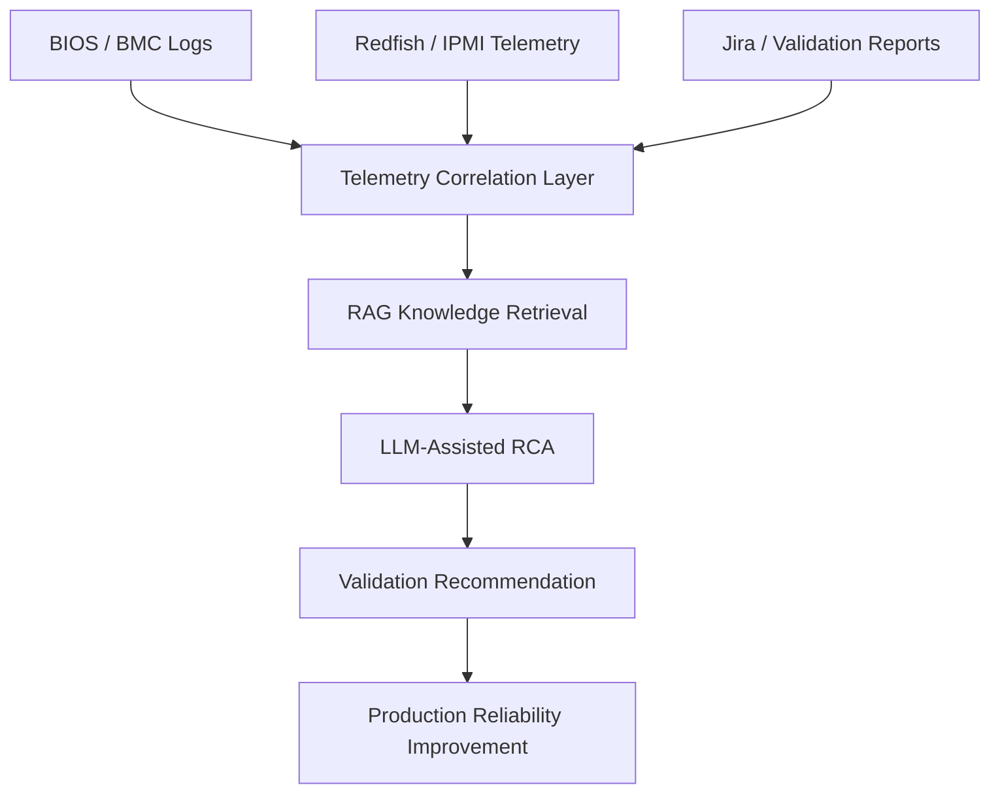

# ai-accelerator-reliability-intelligence
AI-native infrastructure reliability framework for GPU/TPU-class systems.
# AI Accelerator Reliability Intelligence Platform
## Overview

Modern AI infrastructure systems are becoming increasingly complex across firmware, accelerators, power systems, telemetry, networking, validation workflows, and distributed operations.

This project explores an AI-native infrastructure reliability framework designed for GPU/TPU-class environments.

The goal is to transform fragmented engineering knowledge into actionable operational intelligence.

---

## Core Concepts

- Silicon errata intelligence
- Firmware workaround mapping
- Validation coverage analysis
- Telemetry correlation
- AI-assisted root cause analysis (RCA)
- Infrastructure dependency graph analysis
- Predictive reliability workflows
- AI-native infrastructure diagnostics

---

## Why This Matters

As hyperscale AI infrastructure continues scaling, reliability challenges are becoming increasingly difficult to manage across:

- firmware
- drivers
- operating systems
- accelerators
- thermal systems
- power sequencing
- distributed workloads
- validation environments

Traditional engineering workflows were not designed for this level of infrastructure complexity.

This project explores how telemetry, RAG pipelines, infrastructure knowledge graphs, and LLM-assisted reasoning can improve operational reliability at scale.

---

## Proposed Architecture

```text
Silicon Errata
      ↓
Firmware Workaround Mapping
      ↓
Validation Coverage Analysis
      ↓
Telemetry Correlation
      ↓
AI-Assisted RCA
      ↓
Production Reliability Recommendation
      ↓
Fleet Stability



AI-Native Infrastructure Diagnostics Workflow
Mermaid Diagram



Future Exploration Areas
telemetry-driven diagnostics
stepping-aware issue prediction
firmware dependency analysis
infrastructure observability
AI-generated validation recommendation
anomaly detection
fleet-wide operational intelligence
